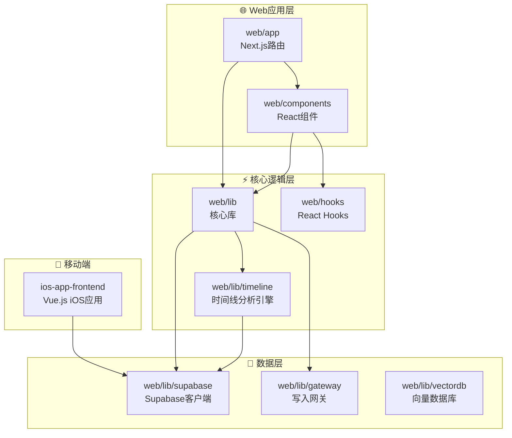
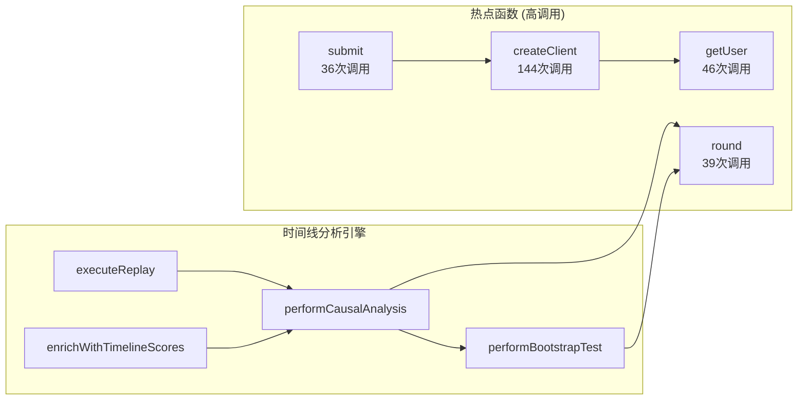
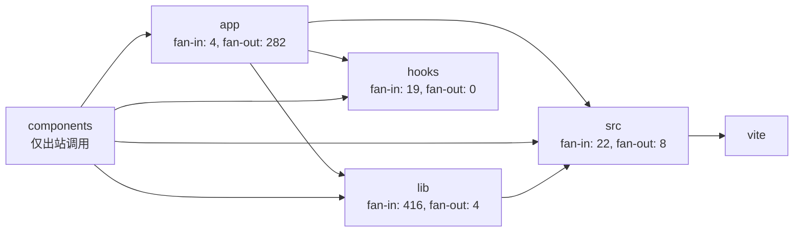

# Nuzzly 代码图谱

## 项目架构概览

## 核心模块调用关系

## 包依赖关系

## 代码统计

| 指标 | 数值 |
|------|------|
| 总节点数 | 3,074 |
| 总边数 | 7,340 |
| 函数 | 1,051 |
| 变量 | 445 |
| 文件 | 372 |
| 模块 | 370 |
| 接口 | 231 |
| TypeScript文件 | 278 |
| Vue文件 | 35 |

## 主要入口点

- **useAuth** - 认证管理
- **usePets** - 宠物数据管理
- **useDailyTasks** - 每日任务
- **useHealthRecords** - 健康记录
- **useNotifications** - 通知系统
- **createClient** - Supabase客户端创建

## 技术栈

- **前端**: Next.js (Web), Vue.js (iOS)
- **数据库**: Supabase (PostgreSQL)
- **类型**: TypeScript, JavaScript
- **UI组件**: React, Vue
